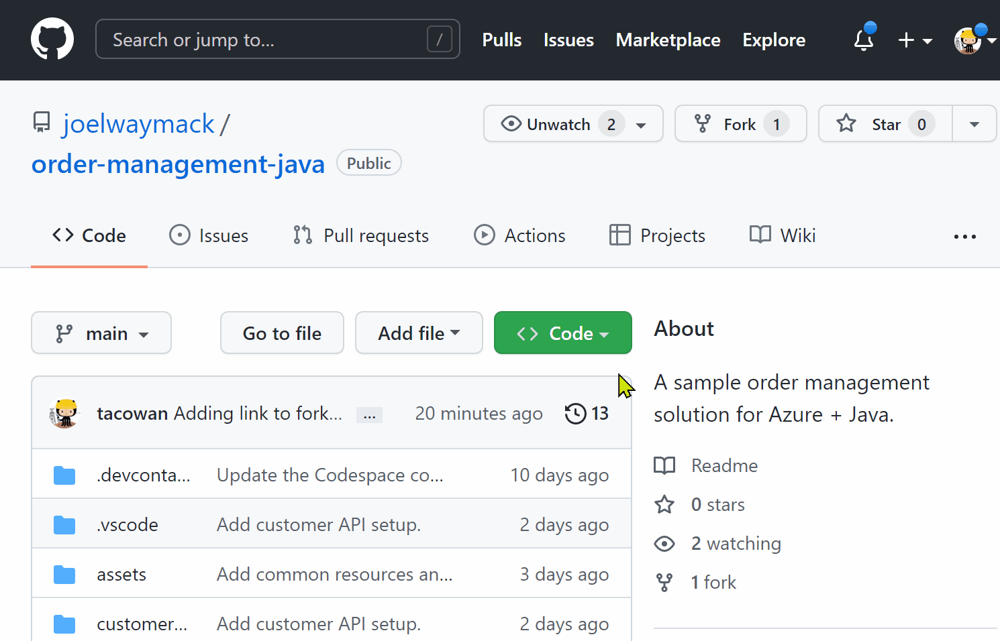

# Order Management for Java

This workshop walks through hosting an Azure-hosted solution utlizing Azure PaaS offerings and is geared toward Java developers.

## Solution Overview

Your company has asked you to help build an order processing system in Azure. For the first portion of this project, you will rehost an existing Order Management App and Customer API that your company already uses. For the second portion of this project, you will build out an Azure Functions driven processing pipeline to complete the overall solution.


To accomplish this task, you will work through the following steps:

1. [Repository Setup](#repository-setup)
1. [Prepare you development environment](#dev-environment-setup)
1. [Set up common Azure resources](#set-up-common-azure-resources)
1. [Deploy the Order Management App](#deploy-the-order-management-app)
1. [Deploy the Customer API and Database](#deploy-the-customer-api-and-database)
1. [Deploy the Order API and Database](#deploy-the-order-api-and-database)
1. [Deploy the Order Processing Pipeline]

## Repository Setup

If the origin repository has not been [forked into your personal GitHub account or your orgnaization's GitHub Organization](https://github.com/joelwaymack/order-management-java/fork), please do so before completing any additional steps.

## Dev Environment Setup

To work effectively you'll need a fully functioning development environment. To keep from having to install a lot of dependencies, a GitHub codespace has been configured for your use. (These steps assume that the original repo has been forked into your GitHub organization.) Follow the steps below to set up your environment:

1. In GitHub, create a new branch with your name or a custom identifier.
1. Go to **Code > New codespace** to open up a development environment for your new branch.



## Set Up common Azure Resources

For this project, you will have a number of Azure resources used for common concerns such as logging and file storage. In this section, we will set up those common resources so they can be used later in our project.

1. Navigate to the [Azure portal](https://portal.azure.com/)
1. Create a new Resource Group to hold all of your Order Management Azure resources. **NOTE: The Subscription, Resource Group, and Region used/created in this step should be used for all other resources being creating**
    * Subscription: Your subscription
    * Name: order-management-[uniquename]-rg
1. Create a new Log Analytics Workspace to hold all of your logs
    * Name: order-management-[uniquename]-log
1. Create an Application Insights resource to capture application logs and metrics
    * Name: order-management-[uniquename]-ai
    * Resource Mode: Workspace-based
    * Log Analytics Workspace: order-management-[uniquename]-log
1. Create a Storage Account to hold files and assets
    * Name: ordermanagement[uniquename]st
    * Redundancy: Locally-redundant storage (LRS)

## Deploy the Order Management App

The Order Management App is a Single Page Application (Angular) that has been transpiled into static assets for hosting. For our purposes, we will host the App as a Static Website from our Storage Account for web access.

1. Turn on Static Website hosting for your Storage Account
    1. In the [Azure Portal](https://portal.azure.com), navigate to your Storage Account
    1. In the side menu select **Data management > Static website**
    1. Toggle the Static website to **Enabled**
    1. Set the site information
        * Index document name: index.html
        * Error document path: index.html
1. Deploy the application to your Storage Account
    1. In your Codespace, right click on **order-management-app** and select **Deploy to Static Website via Azure Storage...**
    1. Select your storage account
1. Add the Application Insights information to the App
    1. Navigate to the App (<https://[storageaccountname>].z13.web.core.windows.net)
    1. Select the settings Cog in the top right corner of the app
    1. Add the Application Insights connection string to the settings

## Deploy the Customer API and Database

The Customer API is a Spring API that interacts with Customer database to track customer information. We will host the API in Azure App Service and the database in Azure SQL Database.

1. Provision and deploy the Customer database
    1. In the [Azure Portal](https://portal.azure.com), create an Azure SQL Database
        * Database name: customer-sqldb
        * Server: Create New
            * Server Name: customer-/[uniquename/]-sqlsvr
            * Server admin login: customeradmin
            * Password: ABCD1234abcd!
            * Confirm password: ABCD1234abcd!
        * Compute + storage: Configure Database
            * Service tier: Basic
        * Backup storage redundancy: Locally-redundant backup storage
    1. Update the Customer database schema
        1. In the [Azure Portal](https://portal.azure.com), navigate to the Customer database
        1. In the side menu, select **Query editor**
        1. Try to log in with your credentials:
            * Login: customeradmin
            * Password: ABCD1234abcd!
        1. If you receive a networking access error, click the link at the end to add your IP address to the whitelist rules.
        1. In the query editor, run the following SQL:

            ```sql
            CREATE TABLE Customers (
                Id UNIQUEIDENTIFIER NOT NULL,
                Name NVARCHAR(100) NOT NULL,
                CONSTRAINT PK_Customers_Id PRIMARY KEY CLUSTERED (Id)
            );
            ```

1. Provision and deploy the Customer API
    1. In the [Azure Portal](https://portal.azure.com), create an Azure App Service Web App
        * Basics > Name: customer-api-[uniquename]-app
        * Basics > Runtime stack: Java 11
        * Basics > Linux Plan: Create New
            * Name: customer-api-plan
        * Basics > Sku and size: Dev/Test B1
        * Monitoring > Enable Application Insights: Yes
        * Monitoring > Application Insights > order-management-[uniquename]-ai
    1. Update the Web App settings with the database information
        1. Navigate to the App Service Web App
        1. In the side menu, select **Settings > Configuration** and add the following Application Settings
            * DB_SERVER_NAME: customer-[uniquename]-sqlsvr
            * DB_NAME: customer-sqldb
            * DB_USERNAME: customeradmin
            * DB_PASSWORD: ABCD1234abcd!
    1. Deploy the Customer API to the Azure App Service Web App
        1. In your Codespace, open up a new Terminal **Terminal > New Terminal**
        1. In the terminal build the API with Maven

            ```bash
            cd customer-api
            mvn package
            ```

        1. In the file explorer, right click on **customer-api > target > customer-api-0.0.1-SNAPSHOT.jar** and select **Deploy to Web App**
        1. Select your Subscription and Web App
    1. Troubleshoot your Customer API
        1. Navigate to your Customer API in your browser (<https://customer-api-[uniquename>]-app.azurewebsites.net)
        1. In the [Azure Portal](https://portal.azure.com), navigate to your App Service **Monitoring > Log stream** to identify the issue
        1. In the Azure SQL Server resource, navigate to **Security > Firewalls and virtual networks**
            * Allow Azure services and resources to access this server: Yes
        1. Navigate to your Customer API again

1. Access the Customer API through the Order Management App
    1. Navigate to the Order Management App (<https://[storageaccountname>].z13.web.core.windows.net)
    1. In the settings, add in the base URL for the Customer API (<https://customer-api-[uniquename>]-app.azurewebsites.net)
    1. The navigate to the Customer section after it appears
    1. Troubleshoot calls to the Customer APi
        1. Open up the developer tools in your browser (F12) to troubleshoot the problem
            1. Note the [CORS error](https://developer.mozilla.org/en-US/docs/Web/HTTP/CORS/Errors)
        1. Navigate to the Customer API in the [Azure Portal](https://portal.azure.com)
        1. In the side menu, select **API > CORS** and add * to the list of Allowed Origins
            1. Note, it will take a few minutes for this update to occur once you save
        1. Refresh the Order Management App to show the list of customers

## Deploy the Order API and Database

The Order API will be created using Azure Functions to expose a set of endpoints for creating orders and viewing their status. All Order data will be stored in an Azure Cosmos Database.

1. Provision the resources in Azure
    1. In the [Azure Portal](https://portal.azure.com), create a Function App
        * Basics > Function App Name: order-management-[uniquename]-func
        * Basics > Runtime stack: Java
        * Basics > Version: 11.0
        * Hosting > Storage Account: ordermanagement[uniquename]st
        * Monitoring > Application Insights: order-management-[uniquename]-ai
    1. In the [Azure Portal](https://portal.azure.com), create a Cosmos DB
        * Core (SQL) API
        * Account Name: order-management-[uniquename]-cosmos
    1. Set up the Cosmos DB and containers
        1. Navigate to the Cosmos DB
        1. In the side menu, select **Data Explorer**
        1. Select **New Container**
            * Database id: OrderManagement
            * Database throughput: Manual
            * Container id: Orders
            * Partition key: /id
1. Create the Function App
    1. Create a new folder named **order-management-func**
    1. Select the Azure Extension in VS Code
    1. In the Functions section, select **Create new project...** (Folder with lightning bolt button)
        * Folder: /workspaces/order-management-java/order-management-func/
        * Language: Java
        * Version: Java 11
        * Group Id: com.function
        * Artifact Id: order-management-func
        * Version: 1.0-SNAPSHOT
        * Package Name: com.function
        * App Name: order-management-[uniquename]-func
    1. Select **F5** to have VS Code start the Function App
    1. Select **Open in Browser** when the port forwarding notification pops up
    1. Navigate to **/api/HttpExample** to see the response of the auto-generated function
1. Organize the Function App and add connection information
    1. Navigate to the **order-management-func/src/local.settings.json** file and add/update the following

        ```json
        {
          "IsEncrypted": false,
          "Values": {
            "AzureWebJobsStorage": "[storage-account-connection-string]",
            "FUNCTIONS_WORKER_RUNTIME": "java",
            "CosmosConnectionString": "[cosmos-connection-string]",
            "DatabaseName": "OrderManagement",
            "Collection": "Orders"
          }
        }
        ```

    1. Create a **order-management-func/src/main/java/com/function/models** folder
    1. Add a new file named **Order.java** to the models folder
        * NOTE: For brevity, getters and setters are not being used

        ```java
        package com.function.models;
    
        import java.time.LocalDateTime;
        import java.util.UUID;
        
        public class Order {
            public UUID id;
            public UUID customerId;
            public String itemName;
            public int quantity;
            public double unitPrice;
            public Double tax;
            public Double total;
            public String createdTimestamp;
            public String paymentTimestamp;
            public String shippedTimestamp;
        }
        ```

1. Create the Order Endpoints
    * NOTE: You can test your API endpoints using the **assets/function.rest** file
    1. Create a **order-management-func/src/main/java/com/function/handlers** folder
    1. Move the **Function.java** file into the handlers folder
    1. Rename **Function.java** to **OrderHandler.java**
    1. Remove the **HttpExample** Function
    1. Add an HTTP Function Trigger for **GetAllOrders** to handle a **GET /api/orders** request

        ```java
        @FunctionName("GetAllOrders")
        public HttpResponseMessage getAllOrders(
            @HttpTrigger(
                name = "req",
                methods = {HttpMethod.GET},
                route = "orders",
                authLevel = AuthorizationLevel.ANONYMOUS)
                HttpRequestMessage<Optional<String>> request,
            @CosmosDBInput(
                name = "orders",
                databaseName = "%DatabaseName%",
                collectionName = "%CollectionName%",
                connectionStringSetting = "CosmosConnectionString",
                sqlQuery = "SELECT * FROM orders")
                List<Order> orders,
            final ExecutionContext context) {
    
            return request.createResponseBuilder(HttpStatus.OK).body(orders).build();
        }
        ```

    1. Add an HTTP Function Trigger for **CreateOrder** to handle a **POST /api/customers/{customerId}/orders** request

        ```java
        @FunctionName("CreateOrder")
        public HttpResponseMessage createOrder(
            @HttpTrigger(
                name = "req",
                methods = {HttpMethod.POST},
                route = "customers/{customerId}/orders",
                authLevel = AuthorizationLevel.ANONYMOUS)
                HttpRequestMessage<Order> request,
            @BindingName("customerId") UUID customerId,
            @CosmosDBOutput(
                name = "orders",
                databaseName = "%DatabaseName%",
                collectionName = "%CollectionName%",
                connectionStringSetting = "CosmosConnectionString")
                OutputBinding<Order> orderOutput,
            final ExecutionContext context) {
    
            context.getLogger().info("New order created for customer " + customerId);
            final Order order = request.getBody();
            order.customerId = customerId;
            order.id = UUID.randomUUID();
            order.createdTimestamp = Instant.now().toString();
    
            orderOutput.setValue(order);
    
            return request.createResponseBuilder(HttpStatus.OK).body(order).build();
        }
        ```

    1. Add an HTTP Function Trigger for **GetCustomerOrders** to handle a **GET /api/customers/{customerId}/orders** request

        ```java
        @FunctionName("GetCustomerOrders")
        public HttpResponseMessage getCustomerOrders(
            @HttpTrigger(
                name = "req",
                methods = {HttpMethod.GET},
                route = "customers/{customerId}/orders",
                authLevel = AuthorizationLevel.ANONYMOUS)
                HttpRequestMessage<Optional<String>> request,
            @CosmosDBInput(
                name = "orders",
                databaseName = "%DatabaseName%",
                collectionName = "%CollectionName%",
                connectionStringSetting = "CosmosConnectionString",
                sqlQuery = "SELECT * FROM orders where orders.customerId = {customerId}")
                List<Order> orders,
            final ExecutionContext context) {
    
            return request.createResponseBuilder(HttpStatus.OK).body(orders).build();
        }
        ```

1. Deploy the Function App
    1. Right click on the **order-management-func** folder and select **Deploy to Function App...**
    1. When it completes select the **Upload settings** button to sync your local settings to the Function App's Application Settings
1. Access the Order API through the Order Management App
    1. Navigate to the Order Management App (<https://[storageaccountname>].z13.web.core.windows.net)
    1. In the settings, add in the base URL for the Function App (<https://order-management-[uniquename>]-func.azurewebsites.net)
    1. The navigate to the Customer section after it appears
    1. Troubleshoot calls to the Customer APi
        1. Open up the developer tools in your browser (F12) to troubleshoot the problem
            1. Note the [CORS error](https://developer.mozilla.org/en-US/docs/Web/HTTP/CORS/Errors)
        1. Navigate to the Function App in the [Azure Portal](https://portal.azure.com)
        1. In the side menu, select **API > CORS** and add * to the list of Allowed Origins
            1. Note, it will take a few minutes for this update to occur once you save
        1. Refresh the Order Management App to show the list of customers

## Deploy the Order Processing Pipeline

The Order processing pipeline will use system events to process the orders at their various stages using the Cosmos DB change feed, Azure Functions, and Azure Event Grid.

1. In the [Azure Portal](https://portal.azure.com), provision an Event Grid Topic in Azure
    * Name: ship-orders-[uniquename]-topic
1. In your Codespace, add an **order-management-func/src/main/java/com/function/models/EventData.java** model to handle publishing and subscribing to the Event Grid Topic

    ```java
    package com.function.models;

    import java.time.Instant;
    import java.util.UUID;
    
    public class EventData {
        public String id = UUID.randomUUID().toString();
        public String eventType = "OrderProcessed";
        public String subject = "OrderProcessed";
        public String eventTime = Instant.now().toString();
        public String dataVersion = "1.0";
        public Order data;
    
        public EventData(Order order) {
            data = order;
        }
    }
    ```

1. Navigate to the **order-management-func/src/local.settings.json** file and add/update the following to the **values**

    ```json
    "EventGridTopicEndpoint": "https://ship-orders-[uniquename]-topic.[region].eventgrid.azure.net/api/events",
    "EventGridTopicKey": "[key1]
    ```

1. Add a Cosmos triggered Function that executes when there are changes to the Orders Collection and processes payment

    ```java
    @FunctionName("ProcessOrderPayment")
    public void processOrderPayment(
        @CosmosDBTrigger(
            name = "ordersInput",
            databaseName = "%DatabaseName%",
            collectionName = "%CollectionName%",
            leaseCollectionName = "leases",
            createLeaseCollectionIfNotExists = true,
            connectionStringSetting = "CosmosConnectionString") Order[] orders,
        @CosmosDBOutput(
            name = "ordersOutput",
            databaseName = "%DatabaseName%",
            collectionName = "%CollectionName%",
            connectionStringSetting = "CosmosConnectionString") OutputBinding<List<Order>> outputOrders,
        @EventGridOutput(
            name = "eventOutput",
            topicEndpointUri = "EventGridTopicEndpoint",
            topicKeySetting = "EventGridTopicKey") OutputBinding<List<EventData>> outputEvents,
        final ExecutionContext context ) {
        List<Order> updatedOrders = new ArrayList<Order>();
        List<EventData> events = new ArrayList<EventData>();

        for (Order order : orders) {
            if (order.paymentTimestamp == null) {
                order.tax = Math.round(order.quantity * order.unitPrice * 0.08 * 100.0) / 100.0;
                order.total = Math.round(order.quantity * order.unitPrice + order.tax * 100.0) / 100.0;
                order.paymentTimestamp = Instant.now().toString();
                context.getLogger().info("Processing payment for order " + order.id);

                updatedOrders.add(order);
                events.add(new EventData(order));
            }
        }

        outputOrders.setValue(updatedOrders);
        outputEvents.setValue(events);
    }
    ```

1. Add an Event Grid triggered Function that executes when there are shipping events to process

    ```java
    @FunctionName("ShipOrder")
    public void shipOrder(
        @EventGridTrigger(name = "shipevent") EventData event,
        @CosmosDBOutput(
            name = "ordersOutput",
            databaseName = "%DatabaseName%",
            collectionName = "%CollectionName%",
            connectionStringSetting = "CosmosConnectionString") OutputBinding<Order> outputOrder,
        final ExecutionContext context ) {
        final Order order = event.data;
        order.shippedTimestamp = Instant.now().toString();

        context.getLogger().info("Shipping order " + order.id);

        outputOrder.setValue(order);
    }
    ```

1. Deploy the new version of the Function App to Azure
    1. In the VS Code Azure Extension Functions section, select the **Deploy to Function App...** button (Cloud with up arrow)
    1. When it completes select the **Upload settings** button to sync your local settings to the Function App's Application Settings

1. Create the Event Grid Subscription for the ShipOrder Function
    1. In the [Azure Portal](https://portal.azure.com), navigate to your Event Grid Topic
    1. Select **+ Event Subscription**
        * Name: ship-sub
        * Endpoint Type: Azure Function
        * Select an endpoint

1. Navigate to the Order Management App and create all the customers and orders you want!
